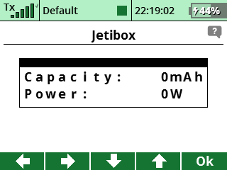
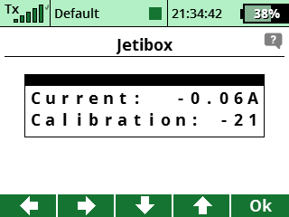

# RC Current Sensor firmware
This is the firmware for my 60A RC current sensor design. The hardware design can be found here: [github](https://github.com/bodri/kapuki-cursen-hw)
and you can read more about this project in my [blog](https://www.bodrico.com/2020/03/rc-current-sensor.html).

# Programming your device
This is a [STM32CubeIDE](https://www.st.com/en/development-tools/stm32cubeide.html) project. You can use the IDE directly to program your device
or simply use the [STM32CubeProgrammer](https://www.st.com/en/development-tools/stm32cubeprog.html) to falsh the provided [hex](https://github.com/bodri/kapuki-cursen-fw/blob/master/kapuki-cursen-fw.hex).

If you use the IDE and you add some features please create a pull-request here that we can share with everyone.

# Using the sensor
Connect the sensor to a JETI EX receiver pin which is set to use EX Bus protocol, like the pin 3 on my REX3 receiver:

There is a functionality in the sensor that you can reset capacity measurement. In order to do that first define the function on your transmitter in the "Functions Assignment" menu:

Now, you can assign this function to a specific channel:

The sensor by default is using channel 8, but you can change that in the sensor settings as I will discribe it later.

# Settings

The sensor needs two settings:
* Offset compensation for current measurement
* Capacity reset channel

This is possible via JetiBox or with the JetiBox application on your transmitter:

The next screen shows the actual current and voltage measurement:

Next is capacity and power:

Now, the real settings are coming. First of all make sure that there is no load on the sensor eg. the output terminal must be open. On the calibration screen you see the actually measured current and a calibration value. Using the Up or Down button the calibration value can be changed. The aim here is to get closer to 0 as much as possibe with the measured current:

On the next screen you can set up the capacity reset channel. The sensor constantly checking this channel and when it receives -100% it will set the used capacity to 0:

On the last screen you can save the settings into the sensor's non-volatile memory with pushing the Up and Down button simultaneously:

That's it folks. 
